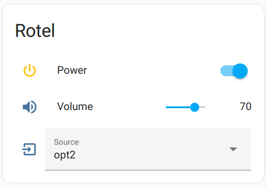

# Rotel Amplifier Control

The code here is for bridging a Rotel Amplifier to MQTT, for integration into Home Assistant,
where the Rotel Amplifier is connected to the serial port of a host machine. The requirements
are:

  * A Linux host connected to the Rotel Amplifier via a RS232 port
  * A MQTT broker running on the same machine or on the network
  * Docker installed on the host machine

To run the docker container on an ARM64 host,

```
docker run --rm --name rotel --device=/dev/ttyUSB1 \
  ghcr.io/djthorpe/rotel-linux-aarch64:1.0.7 \
  rotel -mqtt localhost:1883 -tty /dev/ttyUSB1
```

This assumes that the serial port is `/dev/ttyUSB1` and the MQTT broker is running on the same
machine. The command line arguments for the rotel command are:

```
Usage of rotel:
  -mqtt string
    	MQTT broker address (default "localhost:1833")
  -qos int
    	MQTT quality of service
  -topic string
    	Topic for messages (default "homeassistant")
  -tty string
    	TTY for Rotel device (default "/dev/ttyUSB0")
  -version
    	Print version and exit
```

## Building the Docker Container

To build the docker container, ensure you are logged into docker. The Makefile
contains some parameters you'll want to change. Then,

```
git clone git@github.com:djthorpe/go-rotel.git
cd go-rotel
make docker
```

This will make the container and upload it to the registry.

## Configuring Home Assistant

Assuming you have the MQTT integratiion installed, you can create a card in Home Assistant to control the amplifier, that looks like this:



The card can be created using the following YAML:

```yaml
type: entities
entities:
  - entity: switch.rotel_amp00
  - entity: number.rotel_amp00
  - entity: select.rotel_amp00
title: Rotel
show_header_toggle: false
state_color: true
```

## Contributions, etc

Contributions are welcome. Please raise an issue or pull request on the GitHub repository. The limitations at the me moment are,

  * A -name parameter should uniquely identify the amplifier (at the moment it's hard-coded to "amp00")
  * Only the power, volume and source are exposed (it wouldn't be difficult to expose   more controls). These are the other controls which could be added:
    * ROTEL_FLAG_MUTE
    * ROTEL_FLAG_BASS
    * ROTEL_FLAG_TREBLE
    * ROTEL_FLAG_BALANCE
    * ROTEL_FLAG_BYPASS
    * ROTEL_FLAG_SPEAKER
    * ROTEL_FLAG_DIMMER
  * Implement the following push buttons: play, stop, pause, track_next, track_prev, mute_toggle, vol_up, vol_down, bass_up, bass_down, bass_reset, treble_up, treble_down, treble_reset, balance_left, balance_right, balance_reset, speaker_a_toggle, speaker_b_toggle, dimmer_toggle, power_toggle
  * Code is only tested on an A12 amplifier, but should work on other models
  * A github workflow should be used to build the containers on different
    platforms and architectures
  * Only one amplifier and serial port can be controlled per host
